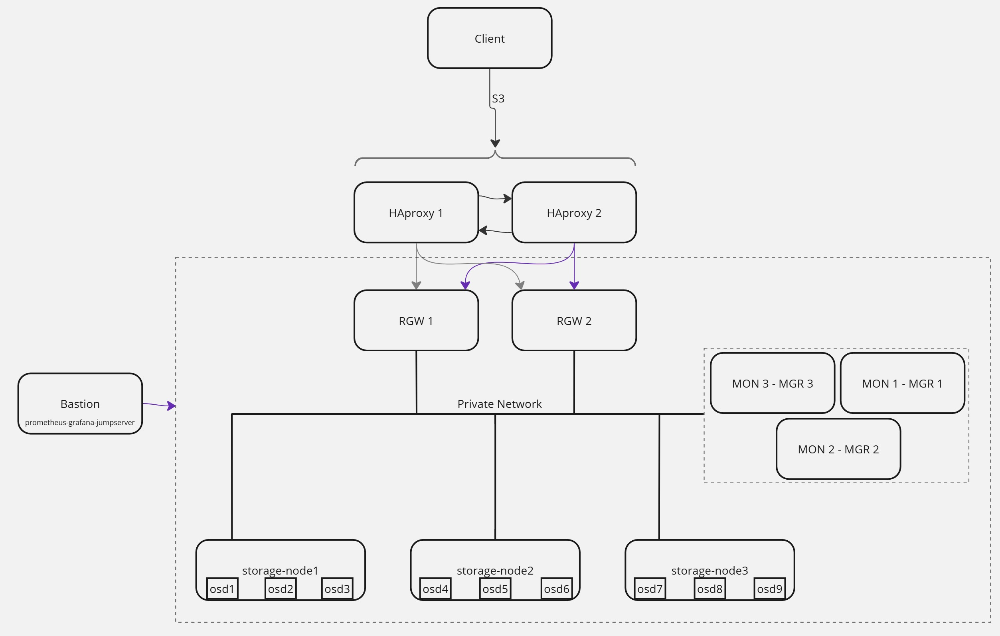

# Object Storage Deployment with Ansible and Ceph

This repository contains an Ansible playbook to deploy and manage an object storage service using Ceph. The playbook is designed to be modular, allowing you to execute specific tasks using tags. Below is a detailed guide on how to use this playbook effectively.

## Table of Contents

- [Overview](#overview)
- [Requirements](#requirements)
- [Cluster Architecture](#cluster-architecture)
- [Playbook Tags](#playbook-tags)
  - [Setup Installation](#setup-installation)
  - [Initialize Ceph Cluster](#initialize-ceph-cluster)
  - [Add Hosts to Cluster](#add-hosts-to-cluster)
  - [Monitoring Stack](#monitoring-stack)
  - [Removing Services](#removing-services)
  - [Creating Client](#creating-client)
  - [Upgrading to New Version](#upgrading-to-new-version)
  - [Maintenance](#maintenance)
- [Using Ansible](#using-ansible)
- [Deploy a New Data Center](#deploy-a-new-data-center)
- [Known Issues](#known-issues)
  - [Ansible Role Refactoring](#ansible-role-structure-needs-refactoring)
  - [Grafana Dashboards and Data Source](#grafana-default-dashboards-and-prometheus-data-source)
  - [Use Cephadm Sub-Module Instead of Commands](#use-cephadm-sub-module-instead-of-commands)
  - [Repeated Checks for Cluster Upgrades](#repeated-checks-for-cluster-upgrades)
  - [Removing OSDs](#removing-osds)
  - [Contribution Guidelines](#contribution-guidelines)

## Overview

This Ansible playbook automates the deployment and management of a Ceph cluster, which provides object storage services. The playbook is organized into roles and tasks that can be executed using specific tags. This modular approach allows you to perform specific actions like adding hosts, removing services, or upgrading the cluster without running the entire playbook.

## Requirements

Before using this Ansible playbook, ensure you meet the following requirement:

- **Ceph Automation Collection**:

  - The `ceph.automation` Ansible collection is required to run this playbook.
  - Install the collection using the following command:
  
  ```bash
  ansible-galaxy collection install ceph.automation
  ```

## Cluster Architecture

Below is a diagram of the cluster structure:



## Playbook Tags

### Setup Installation

To prepare the OS and install necessary components for the Ceph cluster, use the `install` tag. This tag runs the following roles:

- `pre-setup`: Prepares the OS for Ceph installation.

- `hardening`: Applies security hardening measures.

- `docker-install`: Installs Docker, which is required for Cephadm.

- `cephadm-install`: Installs Cephadm, the Ceph deployment tool.

```bash
ansible-playbook playbook/main.yml --tags "install"
```

### Initialize Ceph Cluster

To bootstrap the Ceph cluster, use the `initialize` tag. This tag runs the `ceph_init` role, which initializes the Ceph cluster and fetches the `ceph.pub` SSH key into `tmp/ceph_ssh.pub`.

```bash
ansible-playbook playbook/main.yml --tags "initialize"
```

### Add Hosts to Cluster

You can add new hosts to the Ceph cluster using the following tags:

- `add-mon`: Adds a monitor (MON) host to the cluster.

```bash
ansible-playbook playbook/main.yml --tags "add-mon"
```

- `add-mgr`: Adds a manager (MGR) host to the cluster.

```bash
ansible-playbook playbook/main.yml --tags "add-mgr"
```

- `add-osd`: Adds an OSD (Object Storage Daemon) host to the cluster.

```bash
ansible-playbook playbook/main.yml --tags "add-osd"
```

- `add-rgw`: Adds a RADOS Gateway (RGW) host to the cluster.

```bash
ansible-playbook playbook/main.yml --tags "add-rgw"
```

Each of these roles also performs additional configurations:

- `add-rgw`: Creates an RGW service and an erasure coding profile.

- `add-mgr`: Configures the Dashboard, Balancer, and PG Autoscaler.

- `add-osd`: Uses available devices for OSDs.

### Monitoring Stack

To set up the monitoring stack, use the `monitoring` tag. This role installs and configures Prometheus, Alertmanager, and Grafana on the bastion server. The bastion server is the only host with access to other cluster hosts (MON, OSD and MGR), as they do not have public IP addresses.

```bash
ansible-playbook playbook/main.yml --tags "monitoring"
```

### Removing Services

To remove services or hosts from the cluster, use the following tags:

- `remove-mon`: Removes a monitor (MON) host from the cluster.

```bash
ansible-playbook playbook/main.yml --tags "remove-mon"
```

- `remove-mgr`: Removes a manager (MGR) host from the cluster.

```bash
ansible-playbook playbook/main.yml --tags "remove-mgr"
```

- `remove-osd`: Removes an OSD host from the cluster.

```bash
ansible-playbook playbook/main.yml --tags "remove-osd"
```

- `remove-rgw`: Removes a RADOS Gateway (RGW) host from the cluster.

```bash
ansible-playbook playbook/main.yml --tags "remove-rgw"
```

### Creating Client

To create an S3 client for using the object storage service, use the `client` tag. This role sets up the AWS CLI client for interacting with the Ceph RGW service.

```bash
ansible-playbook playbook/main.yml --tags "client"
```

### Upgrading to New Version

To upgrade the Ceph cluster to a new version, use the `upgrade` tag. This role compares the current version with the new version and then upgrades the cluster.

```bash
ansible-playbook playbook/main.yml --tags "upgrade"
```

### Maintenance

To put a host into maintenance mode or take it out of maintenance mode, use the following tags:

- `enter-maintenance`: Puts all services on a host into maintenance mode.

```bash
ansible-playbook playbook/main.yml --tags "enter-maintenance"
```

- `exit-maintenance`: Takes all services on a host out of maintenance mode.

```bash
ansible-playbook playbook/main.yml --tags "exit-maintenance"
```

- `enter-maintenance-rgw`: Puts the RGW service on a host into maintenance mode.

```bash
ansible-playbook playbook/main.yml --tags "enter-maintenance-rgw"
```

- `exit-maintenance-rgw`: Takes the RGW service on a host out of maintenance mode.

```bash
ansible-playbook playbook/main.yml --tags "exit-maintenance-rgw"
```

## Using Ansible

You can run specific tasks by using the appropriate tags with the ansible-playbook command. Below are some examples:

```bash
# Adding or removing a monitor (MON)
ansible-playbook playbook/main.yml --tags "add-mon"
ansible-playbook playbook/main.yml --tags "remove-mon"

# Adding or removing an OSD
ansible-playbook playbook/main.yml --tags "add-osd"
ansible-playbook playbook/main.yml --tags "remove-osd"

# Adding or removing a manager (MGR)
ansible-playbook playbook/main.yml --tags "add-mgr"
ansible-playbook playbook/main.yml --tags "remove-mgr"

# Adding or removing a RADOS Gateway (RGW)
ansible-playbook playbook/main.yml --tags "add-rgw"
ansible-playbook playbook/main.yml --tags "remove-rgw"

# Upgrading the cluster
ansible-playbook playbook/main.yml --tags "upgrade"

# Creating an S3 client
ansible-playbook playbook/main.yml --tags "client"

# Setting up monitoring
ansible-playbook playbook/main.yml --tags "monitoring"

# Pre-setup OS and Ceph
ansible-playbook playbook/main.yml --tags "install"

# Bootstrap the cluster
ansible-playbook playbook/main.yml --tags "initialize"

# Enter maintenance mode for all services
ansible-playbook playbook/main.yml --tags "enter-maintenance"

# Exit maintenance mode for all services
ansible-playbook playbook/main.yml --tags "exit-maintenance"

# Enter maintenance mode for RGW service
ansible-playbook playbook/main.yml --tags "enter-maintenance-rgw"

# Exit maintenance mode for RGW service
ansible-playbook playbook/main.yml --tags "exit-maintenance-rgw"
```

## Deploy a New Data Center

To deploy a new data center, you can use all the necessary tags in a single command:

```bash
ansible-playbook playbook/main.yml --tags "install,initialize,add-mon,add-mgr,add-osd,add-rgw,monitoring"
```

## Known Issues

While this Ansible playbook is functional and has been designed to automate the deployment and management of a Ceph-based object storage service, there are some known issues and areas for improvement. Below is a detailed explanation of these issues:

---

### **Ansible Role Structure Needs Refactoring**

- **Current State**: The playbook currently uses multiple roles for specific tasks, such as `add-mon`, `add-rgw`, `add-osd`, etc. This structure can lead to redundancy and increased complexity.
- **Expected Improvement**: The roles should be consolidated into broader, more logical categories, such as:
  - **Common-setup**: Handles OS preparation, security hardening, and dependency installation.
  - **Ceph-setup**: Manages Ceph-specific installations and configurations.
  - **Ceph-init**: Handles the initialization of the Ceph cluster.
  - **Add-components**: Combines all roles for adding MON, MGR, OSD, and RGW into a single role.
  - **Remove-components**: Combines all roles for removing MON, MGR, OSD, and RGW into a single role.
  - **Maintenance**: Handles entering and exiting maintenance mode for all services.
  - **Upgrade**: Manages cluster upgrades.
- **Impact**: Refactoring the roles will make the playbook easier to maintain, extend, and debug.

---

### **Grafana Default Dashboards and Prometheus Data Source**

- **Current State**: When the monitoring stack is deployed, Grafana comes without any dashboards.
- **Expected Improvement**: The playbook should allow users to:
  - Grafana dashboards already on it .
  - Configure additional data sources if needed.
  - Remove or modify default dashboards to avoid clutter.
- **Impact**: This will provide more flexibility and ensure that the monitoring stack is tailored to the user's needs.

---

### **Use Cephadm Sub-Module Instead of Commands**

- **Current State**: The playbook uses shell commands to interact with Cephadm, which can lead to inconsistencies and errors.
- **Expected Improvement**: Replace shell commands with the official Cephadm Ansible sub-module. This will:
  - Improve reliability and maintainability.
  - Ensure compatibility with future Ceph releases.
  - Provide better error handling and logging.
- **Impact**: Using the Cephadm sub-module will make the playbook more robust and aligned with best practices.

---

### **Repeated Checks for Cluster Upgrades**

- **Current State**: The playbook does not perform repeated checks to ensure that the cluster upgrade process is successful. This can lead to incomplete or failed upgrades.
- **Expected Improvement**: Implement a mechanism to:
  - Verify the current cluster state before upgrading.
  - Monitor the upgrade process in real-time.
  - Retry failed steps or roll back changes if necessary.
- **Impact**: This will ensure that upgrades are performed smoothly and without disrupting the cluster.

---

### **Removing OSDs**

- **Current State**: The process of removing OSDs (Object Storage Daemons) from the cluster is not fully optimized. It may leave behind residual configurations or fail to rebalance data properly.
- **Expected Improvement**: Enhance the `remove-osd` role to:
  - Safely rebalance data before removing an OSD.
  - Clean up all associated configurations and resources.
  - Provide clear logs and status updates during the removal process.
- **Impact**: This will ensure that OSD removal is safe, efficient, and does not impact cluster performance.

---

### Contribution Guidelines

If you encounter any of these issues or have suggestions for improvements, feel free to:

- Open an issue on GitHub to discuss the problem.
- Submit a pull request with your proposed changes.
- Reach out to the maintainers for guidance.

Your contributions are highly appreciated and will help make this project better for everyone!

---

By addressing these known issues, we can significantly improve the functionality, reliability, and usability of this Ansible playbook. Thank you for your understanding and support!
